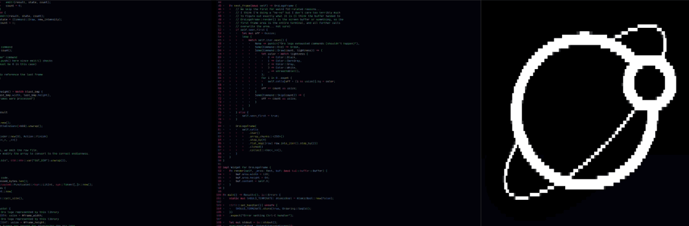

 
 

This houses the RLE-like image format decoder for progressive animation of the Oro logo
in constrained environments, such as kernels and embedded devices.

A singular, concrete, non-generic iterator type is exposed (`OroLogo`) that, when iterated,
gives an endless stream of cursor commands useful for continuously updating a persistent buffer
of pixel information.

The format supports up to 4 lightness levels (`0..=3`) that can be used for
a primitive amount of anti-aliasing, and are supported by many OLED/LCD displays alike.

The iterator itself performs a single base draw on the first frame, followed by an endless looping
stream of update frames that modify the previously drawn frame directly. This includes the frame
that 'wraps around' to the first frame, avoiding expensive redraws when the animation loops (however
there is still a small decompression cost upon looping).

The library is optimized for cases where individual pixel updates are expensive (e.g. direct-to-framebuffer
rasterizer implementations, such as those found in the Oro kernel, or bus-issued pixel updates, such as those
over SPI or I2C lines).

# License
Copyright &copy; 2023, Joshua Lee Junon.

A license is to be determined. Please do not use code in this repository in any fashion until one is issued.
